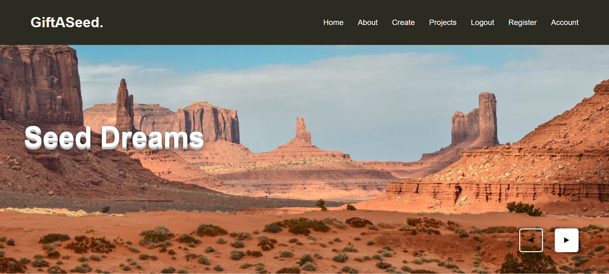
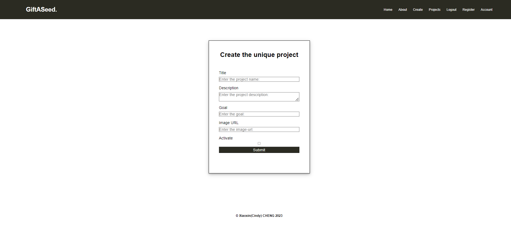
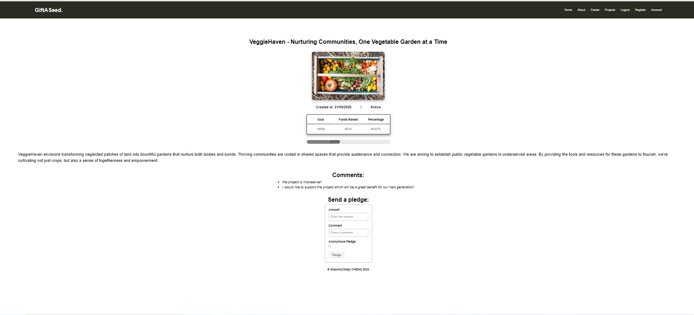
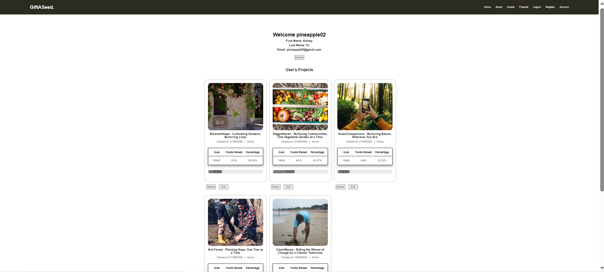

# React + Vite

<!-- This template provides a minimal setup to get React working in Vite with HMR and some ESLint rules.

Currently, two official plugins are available:

- [@vitejs/plugin-react](https://github.com/vitejs/vite-plugin-react/blob/main/packages/plugin-react/README.md) uses [Babel](https://babeljs.io/) for Fast Refresh
- [@vitejs/plugin-react-swc](https://github.com/vitejs/vite-plugin-react-swc) uses [SWC](https://swc.rs/) for Fast Refresh -->

# GiftASeed crowdfunding frontend project:
[1] This is the assignment project for React Module from She Codes Plus Cohort 2023 Brisbane.
[2] Deployed on https://gift-a-seed.netlify.app/
[3] Locally run project: npm run dev
[4] Test account: 
username: pineapple02
password: Welcome@1234
The test account is the project owner of projectId:3/4/6/7/9
[5] Backend was built based on DRF and deployed on https://seedagift.fly.dev/projects/

# Improvements needed in the future:
[1] I included <NavBar /> and <Footer /> individually in each page. I know there is a better way to add pages as children in the main.jsx/createBrowserRouter. I tried serveral times and can't figure out how to make the css right. It seems that the parent <NavBar />'s CSS will affect the children's CSS.
[2] Fetching project owner's user details has presented a challenge due to multiple hook errors. The issue arises from an attempt to set project.owner as the userId within the same component. I think I can separately fetch project data and owner details. I will do it later when I have time.
[3] I use "hasToken" in the main.jsx(path: "/user"),to identify the path to /login/ or to /user based on user logged in or not. I am not sure if it is a right way to do that? 
[4] I need continue to learn how to debug. 

# Appreciation.
I want to share that I didn't believe I could finish this project. It felt like it took forever, especially because I'm new to coding. For the past two weeks, I used nearly all my after work free time on this. Each part of it was not easy for me. I started with zero coding experience just three months ago, and my progress has been slow.

But as this cohort comes to an end, especially in the React module, something changed. Finally, I started understanding some of the concepts, and things became clearer. It's been a journey, and I'm proud of how far I've come.

I want to express my sincere gratitude to my Lead Mentor, Lachlan, and all the mentors—Chris, Andrew, Reece, Manasa, Ali, Carlie and Bel—for their guidance and support throughout this journey. Your expertise and encouragement have played an important role in my progress. Thank you.

Please include the following in your readme doc:
[x] A link to the deployed project.
https://gift-a-seed.netlify.app/
[x] A screenshot of the homepage

[x] A screenshot of the project creation page/form

[x] A screenshot of a project with pledges

[x] A screenshot of the resulting page when an unauthorized user attempts to edita project (optional, depending on whether or not this functionality makes sense inyour app!)
I design the function like this: 
* Only project owner can see the "Account" button when the project owner logged in
* The "Edit" button is located in the Account Page.
* 

